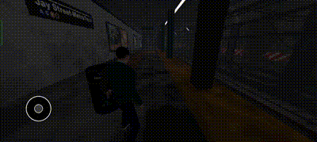

# Godot Virtual Joystick Addon

A customizable and easy-to-use virtual joystick addon for Godot, perfect for mobile games or any project that requires intuitive touch-based controls.

---


### Joystick in Action

Here is a preview of how the joystick looks and functions in the game:




## Features

- **Customizable Appearance:** Easily change the color and style of joystick components to match your game's theme.
- **Simple to Integrate:** Add the joystick to your game with minimal setup and effort.
- **Functional Direction Handling:** Use the `get_direction()` function to retrieve the current direction of the joystick, enabling straightforward movement mechanics.

---

## Installation

1. Download a desired version from the releases section and paste the ```Virtual Joystick``` folder in the ```res://addons/``` directory in your project.
2. Enable the plugin from the ```Project settings > Plugins```.
3. Add a ```VirtualJoystick``` node in your controller scene.
4. Set the position and use it.

## Getting the Direction
- Use the get_direction() function to get the current direction of the joystick. The returned value is a normalized Vector2 representing the joystick's direction.

```
func _process(delta):
    var direction = $VirtualJoystick.get_direction()
    if direction != Vector2.ZERO:
        move_and_slide(direction * SPEED)
```


